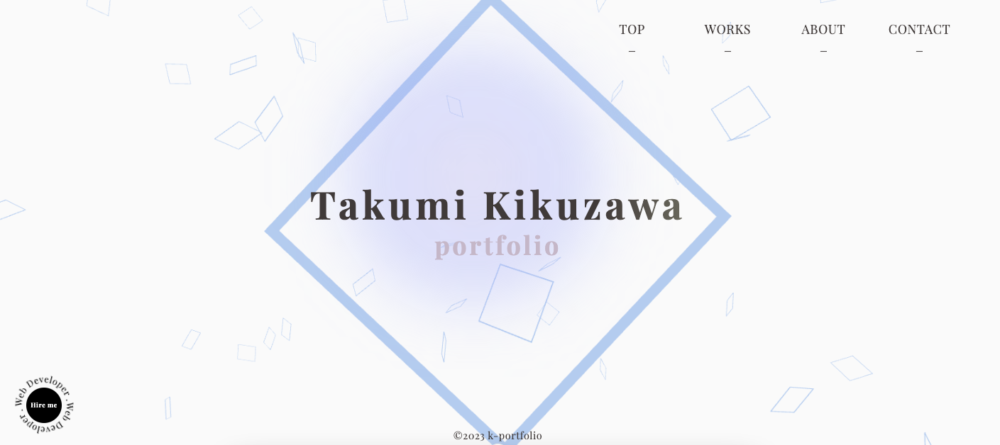
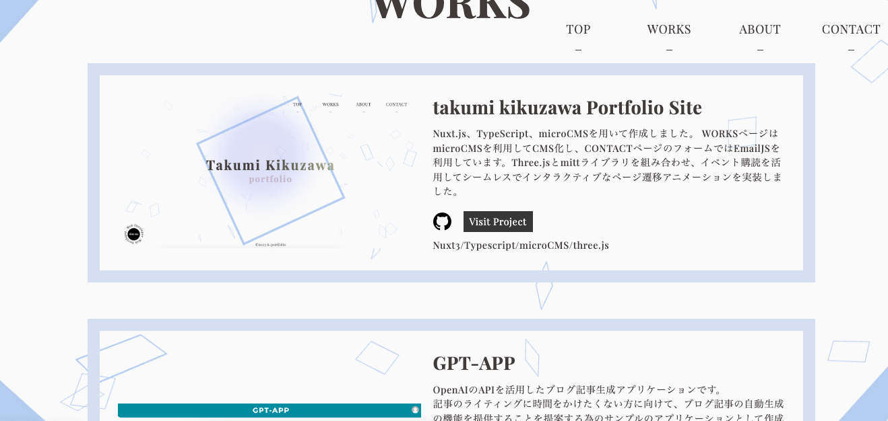

# takumi kikuzawa Portfolio Site

トップページ 
<a href="https://taku-kiku.vercel.app" target="_blank">https://taku-kiku.vercel.app</a> 
 

Nuxt.js、TypeScript、microCMSを用いて作成しました。 
WORKSページはmicroCMSを利用してCMS化し、CONTACTページのフォームではEmailJSを利用しています。Three.jsとmittライブラリを組み合わせ、イベント購読を活用してシームレスでインタラクティブなページ遷移アニメーションを実装しました。  

## 利用している技術

<ul>
<li>Nuxt.js 3</li>
<li>TypeScript</li>
<li>Sass</li>
<li>microCMS</li>
<li>EmailJS</li>
<li>Three.js</li>
<li>GSAP</li>
<li>Vercel</li>
</ul>

## DEMO

